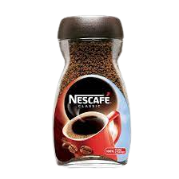
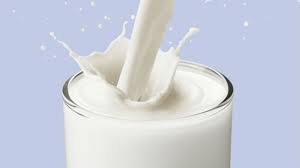
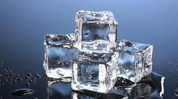
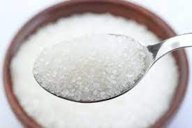
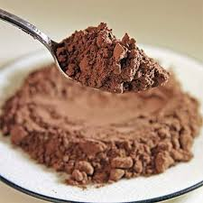

# Cold Coffee
***The most Desirable thing on Earth***

**The thing beyond delicious**

## Overview 
---
Hi Everyone , I will be sharing you my Recipe for making **Cold Coffee** or **Iced Coffee**.
  
It is very Simple to make but it becomes more __Delicious__ with *Extra Things* :wink: like *Garnish* .

## Let's Start :thumbsup: !!

## [Ingredients](ingredients.md)
---
### These are the Ingredients needed :
1. Coffee (Obviously !) 
     

2. Cold Milk
    - it will much better if it is with high fat s othat it will produce more bubbles and better .
 

3. Ice Cubes :ice_cube:
    - it will make it colder as cold milk will not make it like we want . 
 

4. Sugar
    - it blends a sweets taste as without it will taste bitter . you can increase or decrease the amount as you like . 
 

5. Coca Powder
    - it will help in garnishing and giving a texture to the final product .  
 

### Tools :
1. Blender 
    - it will help to mix all the ingredients together and is much better than stiring . 

# [Recipe](recipe.md) :

1. First you Need to gather all the [Ingredients](ingredients.md).

2. Then you need to mix all the ingredients together in a Blender . This will help to stir everything evenly and will give a even Texture .

> Optional Tip :wink: :
    Take a glass and add some Chocolate Syrup around the glass sides for decoration .

3. After mixing it for a while , take it out in a glass and sprinkle some coca powder on the top .

# ENJOY :yum: !!!