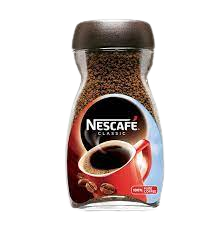
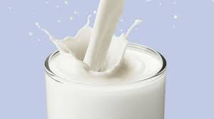
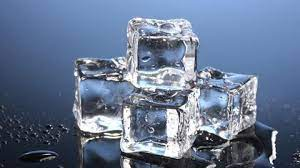
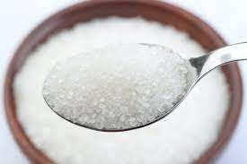
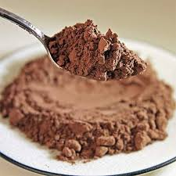

* These are the Ingredients needed :
    ===
    1. Coffee (Obviously !) 
     
    
    2. Cold Milk
        - it will much better if it is with high fat s othat it will produce more bubbles and better .
     
    
    3. Ice Cubes :ice_cube:
        - it will make it colder as cold milk will not make it like we want . 
     
    
    4. Sugar
        - it blends a sweet taste as without it will taste bitter . you can increase or decrease the amount as you like . 
     
    
    5. Coca Powder
        - it will help in garnishing and giving a texture to the final product .  
     
    
* Tools :
    ===
    1. Blender 
        - it will help to mix all the ingredients together and is much better than stiring . 